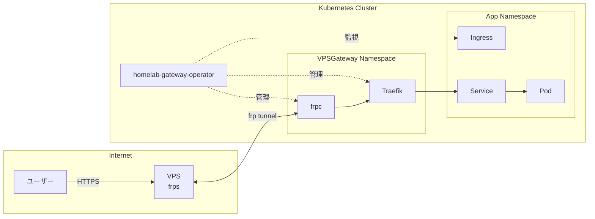

# Homelab Gateway Operator

[frp](https://github.com/fatedier/frp) (Fast Reverse Proxy) を使用して、VPS ゲートウェイ経由でホームラボのアプリケーションをインターネットに公開する Kubernetes オペレーター。

## 概要

このオペレーターは、VPS を通じて Kubernetes サービスを公開するためのライフサイクル全体を管理します：

- frpc (frp クライアント) をデプロイし、VPS へのトンネルを確立
- HTTP/HTTPS トラフィック用の Ingress コントローラーとして Traefik を管理
- Ingress のドメインを自動的に frpc 設定に同期
- cert-manager と連携して TLS 証明書を自動発行
- external-dns と連携して DNS レコードを自動管理
- オプションで VPS 経由の Egress プロキシを提供

## 機能

- **Ingress 管理**: Ingress リソースを監視し、frp トンネルを自動設定
- **TLS サポート**: cert-manager との連携による証明書の自動プロビジョニング
- **DNS 統合**: external-dns 用の DNSEndpoint リソースを作成
- **カスタムドメイン**: ワイルドカードドメイン（例: `*.example.com`）をサポート
- **Egress プロキシ**: VPS 経由のアウトバウンドトラフィック用 HTTP プロキシ（オプション）
- **Namespace スコープ**: マルチテナンシー対応の Namespace スコープリソース

## アーキテクチャ



## 前提条件

- Kubernetes クラスター v1.25 以上
- frps (frp サーバー) が稼働している VPS
- [cert-manager](https://cert-manager.io/)（TLS 証明書用）
- [external-dns](https://github.com/kubernetes-sigs/external-dns)（オプション、DNS 管理用）

## インストール

Helm リポジトリを追加してインストール：

```bash
helm repo add homelab-gateway-operator https://hmdyt.github.io/homelab-gateway-operator
helm repo update

helm install homelab-gateway-operator homelab-gateway-operator/homelab-gateway-operator \
  --namespace vps-gateway-system \
  --create-namespace
```

## クイックスタート

### 1. frp 認証用の Secret を作成

```yaml
apiVersion: v1
kind: Secret
metadata:
  name: frp-token
  namespace: vps-gateway-system
type: Opaque
stringData:
  token: "your-frp-authentication-token"
```

### 2. VPSGateway リソースを作成

```yaml
apiVersion: gateway.hmdyt.github.io/v1alpha1
kind: VPSGateway
metadata:
  name: main
  namespace: vps-gateway-system
spec:
  vps:
    address: "your-vps-ip-or-hostname"
  frp:
    port: 7000
    tokenSecretRef:
      name: frp-token
  ingress:
    enabled: true
    ingressClassName: "vps-gateway-main"
    tls:
      enabled: true
      issuer: "letsencrypt-prod"
    dns:
      enabled: true
```

### 3. アプリケーションを公開する Ingress を作成

```yaml
apiVersion: networking.k8s.io/v1
kind: Ingress
metadata:
  name: my-app
  namespace: my-app-namespace
spec:
  ingressClassName: vps-gateway-main
  rules:
    - host: app.example.com
      http:
        paths:
          - path: /
            pathType: Prefix
            backend:
              service:
                name: my-app
                port:
                  number: 80
```

オペレーターが自動的に以下を実行します：
- `app.example.com` を frpc 設定に追加
- external-dns 用の DNSEndpoint を作成（有効な場合）
- VPS から Traefik 経由でサービスへトラフィックをルーティング

## 設定

### VPSGateway Spec

| フィールド | 説明 | デフォルト |
|-----------|------|-----------|
| `vps.address` | VPS の IP アドレスまたはホスト名 | (必須) |
| `frp.port` | frp サーバーポート | `7000` |
| `frp.tokenSecretRef.name` | frp トークンを含む Secret 名 | (必須) |
| `frp.tokenSecretRef.key` | Secret 内のトークンキー | `token` |
| `frp.image` | frpc コンテナイメージ | `snowdreamtech/frpc:0.53.2` |
| `ingress.enabled` | Ingress 管理を有効化 | `true` |
| `ingress.ingressClassName` | IngressClass 名 | (必須) |
| `ingress.customDomains` | 静的に追加するドメイン | `[]` |
| `ingress.controller.enabled` | Traefik をデプロイ | `true` |
| `ingress.controller.image` | Traefik イメージ | `traefik:v3.2` |
| `ingress.controller.replicas` | Traefik レプリカ数 | `1` |
| `ingress.tls.enabled` | TLS を有効化 | `true` |
| `ingress.tls.issuer` | cert-manager Issuer 名 | `letsencrypt-prod` |
| `ingress.dns.enabled` | DNSEndpoint リソースを作成 | `true` |
| `ingress.dns.ttl` | DNS レコード TTL（秒） | `300` |
| `egress.enabled` | Egress プロキシを有効化 | `false` |
| `egress.proxyPort` | Egress プロキシポート | `3128` |
| `egress.noProxy` | プロキシをバイパスするホスト | `[]` |

## 開発

このプロジェクトは開発環境に nix を使用しています。すべてのコマンドは `nix develop` シェル内で実行してください：

```bash
# ビルド
nix develop -c go build ./...

# ユニットテスト
nix develop -c make test

# E2E テスト
nix develop -c make e2e-test

# DeepCopy コード生成
nix develop -c make generate

# CRD マニフェスト生成
nix develop -c make manifests
```
