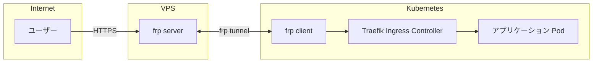

# Homelab Gateway Operator

Kubernetes Operator で VPS ゲートウェイ接続を管理し、ホームラボ環境から外部へのトラフィックルーティングを自動化します。

## 概要

Homelab Gateway Operator は、Kubernetes クラスタと リモート VPS 間のブリッジを構築します。frp (fast reverse proxy) を使用したリバースプロキシトンネリング、Traefik による Ingress Controller 管理、cert-manager/external-dns との連携による TLS 証明書・DNS レコードの自動管理を提供します。



## 機能

- **VPS ゲートウェイ管理**: frp クライアントのデプロイと設定を自動化
- **Ingress Controller 管理**: Traefik の自動デプロイ・設定
- **TLS 自動化**: cert-manager と連携した証明書の自動発行
- **DNS 自動化**: external-dns と連携した DNS レコードの自動管理
- **Egress プロキシ** (オプション): アウトバウンドトラフィックのプロキシ

## 前提条件

- Kubernetes >= 1.25
- VPS サーバー上で動作する frp サーバー (frps)
- cert-manager (TLS を使用する場合)
- external-dns (DNS 自動管理を使用する場合)

## インストール

```bash
helm install homelab-gateway-operator oci://ghcr.io/hmdyt/homelab-gateway-operator
```

## 使い方

### 1. frp トークン用の Secret を作成

```bash
kubectl create secret generic frp-token \
  --namespace=vps-gateway-system \
  --from-literal=token=YOUR_FRP_TOKEN
```

### 2. VPSGateway リソースを作成

```yaml
apiVersion: gateway.hmdyt.github.io/v1alpha1
kind: VPSGateway
metadata:
  name: main
spec:
  vps:
    address: "your-vps-ip-or-hostname"

  frp:
    port: 7000
    tokenSecretRef:
      name: frp-token
      namespace: vps-gateway-system

  ingress:
    enabled: true
    controller:
      enabled: true
    tls:
      enabled: true
      issuer: "letsencrypt-prod"
    dns:
      enabled: true
```

### 3. Ingress を作成してアプリケーションを公開

```yaml
apiVersion: networking.k8s.io/v1
kind: Ingress
metadata:
  name: my-app
  namespace: default
spec:
  ingressClassName: vps-gateway-main  # vps-gateway-{VPSGateway名}
  rules:
    - host: myapp.example.com
      http:
        paths:
          - path: /
            pathType: Prefix
            backend:
              service:
                name: my-app
                port:
                  number: 80
```

Operator が自動的に以下を実行します:
- DNS レコードの作成 (DNSEndpoint)
- TLS 証明書の発行 (Certificate)
- frp 設定の更新

## 設定リファレンス

### VPSGateway Spec

| フィールド | 説明 | デフォルト |
|-----------|------|-----------|
| `vps.address` | VPS の IP アドレスまたはホスト名 | (必須) |
| `frp.port` | frp サーバーポート | `7000` |
| `frp.tokenSecretRef` | 認証トークンの Secret 参照 | (必須) |
| `frp.image` | frpc コンテナイメージ | `snowdreamtech/frpc:0.53.2` |
| `ingress.enabled` | Ingress 機能の有効化 | `true` |
| `ingress.ingressClassName` | IngressClass 名 | `vps-gateway-{name}` |
| `ingress.controller.enabled` | Traefik 管理の有効化 | `true` |
| `ingress.controller.image` | Traefik イメージ | `traefik:v3.2` |
| `ingress.controller.replicas` | Traefik レプリカ数 | `1` |
| `ingress.tls.enabled` | TLS の有効化 | `true` |
| `ingress.tls.issuer` | cert-manager ClusterIssuer 名 | `letsencrypt-prod` |
| `ingress.dns.enabled` | DNSEndpoint 作成の有効化 | `true` |
| `ingress.dns.ttl` | DNS レコード TTL (秒) | `300` |
| `egress.enabled` | Egress プロキシの有効化 | `false` |
| `egress.proxyPort` | プロキシポート | `3128` |
| `egress.noProxy` | プロキシをバイパスするホスト | `[]` |

## 開発

開発環境には Nix を使用しています。

```bash
# ビルド
nix develop -c go build ./...

# ユニットテスト
nix develop -c make test

# E2E テスト
nix develop -c make e2e-test

# コード生成
nix develop -c make generate
nix develop -c make manifests
```
